[PAGE PRINCIPALE](https://github.com/wSzki/legrand)

# [USA] [WINE.com](https://www.wine.com/)

## Landing Page
  Logo relatively small, see search and varietal, region, featured, gift pull down tabs, account, cart. Promotional lage
  Spanise wine up to 40% off, 30 great wines under $30, new arrivals, suggestions, buy on app, popular gifts, popular wines

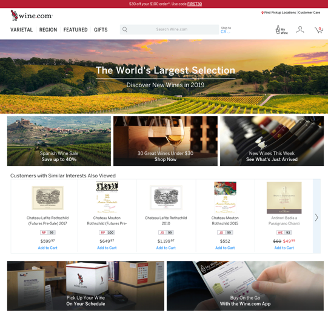
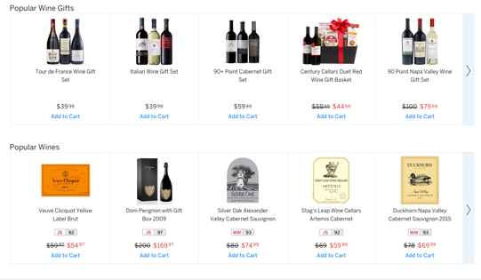

## Design Features
  White with a lot of colour, How to search very clear, easy search bar. All wines present 14204 wines… sort then by (see search features) 

## Search Features 
  2 different search areas top which pull down (Varietal, regional, featured, gift. Featured: search (by rating 94+, by bottle size, by eg older vintages, smaller production,
  *large search of all wines then sort by variety, region, rating and price, reviewed by, size and type, fine wine, vintage. 
  Top rated, trending, deals, 

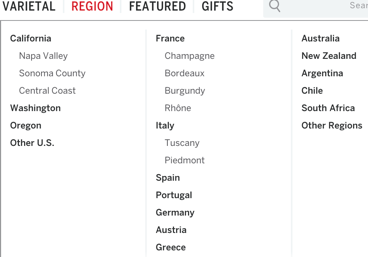 
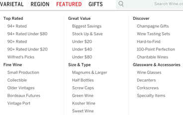 
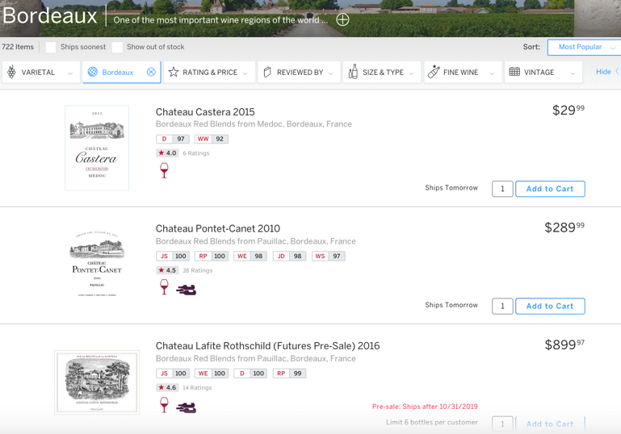 

## Other Features 
  Online person to talk to for help
  Do presale of Bordeaux futures
  log in account, save wines, wish list, rate wines etc
  other offerings, glasses, some products, chocolate, epicery
  Inbformational and educational pages 

## Single Bottle Page 

Lable to side, heading at top, Buy to right and how many
Then a lot of reviews or 1 depending if it’s a top pick
Reviews from members
Real time inventory by location 
You also may be interested in…
Additional information
Varietal, country, sub-region, alcohol content, orangic yes no etc

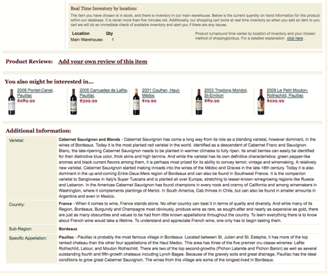

## Shipping / Notes 

Not all located in one place so depends can ship directly / separatly or bring to one location
Notes: doesn’t have that mich on producer like first site which was attractice
*California family owned business since 1976

---
---
---

# [USA] [KL WINE](https://www.klwines.com/)

## Landing Page
Top R, login, cart, checkout
*top: wines, spirits auctions, wine clubs, accessories, delivery, contact 
*search, advanced searched, …
Side: shop by…
Middle new arrivals, top pics, auctions, best sellers 
Side: news, coming soon, top 10, local events, reports etc

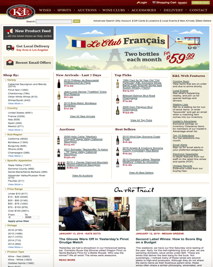
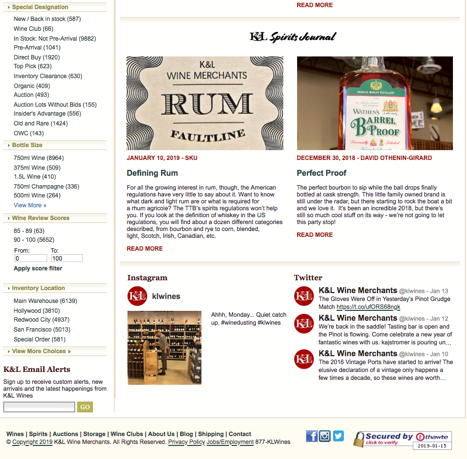

## Design Features
Easy to navigate with categories –
*white 
Big “le club francaise” – promotion
*logo – older but webpage more classic, using newer fonts

## Search Features 
By variety, country, subregion specifical appelations, price range, vintages, special designation – wine club, back in stock, organic, auction, old and rare, acution etc bottle size, wine scores, inventory location

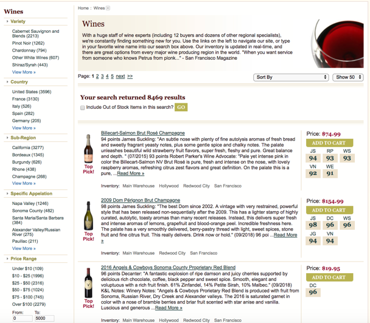 

## Other Features 
Offers spirits and beer too 
Join clubs
Personalized sommelier service where they tailor monthly wine prorams 
Online action – hard to find older wines

## Single Bottle Page 
Lable to side, heading at top, Buy to right and how many
Then a lot of reviews or 1 depending if it’s a top pick
Reviews from members
Real time inventory by location 
You also may be interested in…
Additional information
Varietal, country, sub-region, alcohol content, orangic yes no etc

## Shipping / Notes 

Not all located in one place so depends can ship directly / separatly or bring to one location
Notes: doesn’t have that mich on producer like first site which was attractice
*California family owned business since 1976

---
---
---

# [USA] [LAST BOTTLE CALIFORNIA](http://www.lastbottlewines.com/) 

## Landing Page
*Large site name
*Person holding one bottle
*Side crossed out process of retail, best web price. Price today…
Under bottle the name and description, very much selling bottle
Second “nerdy section”
To left “menu” that falls down
*Log in / create account

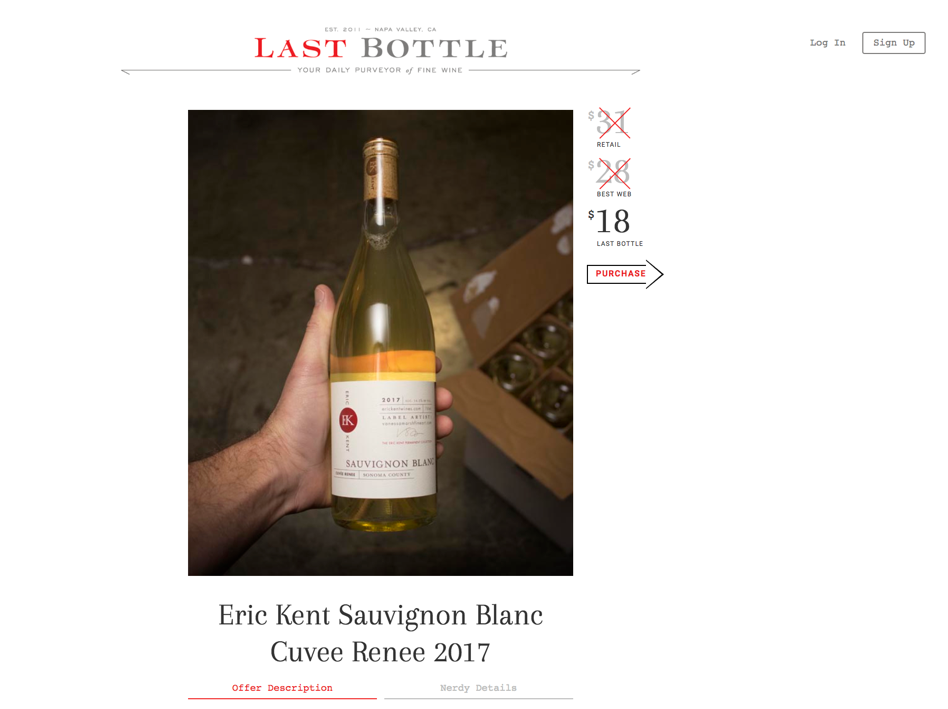

## Design Features
White clean neat, easy to navigate, simple

## Search Features 
Just a side bar “menu” with current offer, about, blog, past offers, invite your friend, FAQs, contact, sell wine, download the app, 

## Other Features 
Blog – whole different website to learn about wine, join a community, articles, links to their social media, all articles with photo and write if educational, food, news, our wines etc

## Single Bottle Page 
Description – really good, very promotional, describes vintage little of estate, goes into tasting notes.
Nex to it click nerdy details
The cru classification, location in dertail, propetair name, photos that flick automatically
Technical details: counry region, appellation, blend, varietal, vineyard, farming, aging / co-op, alcohol
About producer
Pairing suggestions

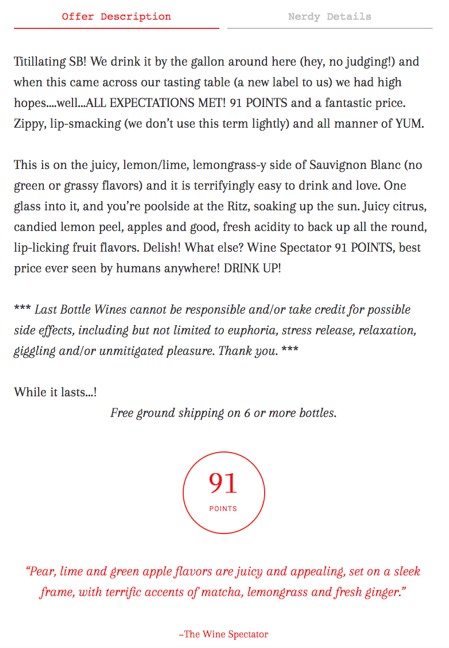
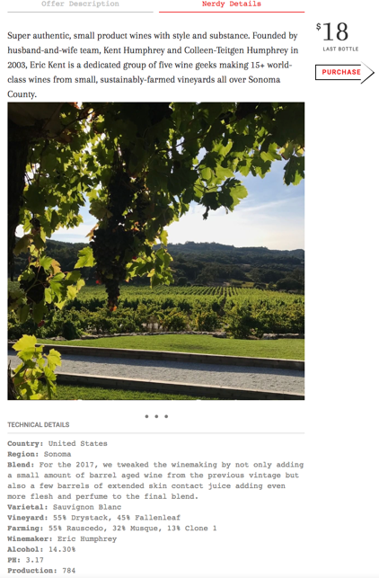

## Shipping / Notes 
Long policy of reading

---
---
---

# [] (PRESTASHOP) [FINESTWINE](http://www.finestwine.com/) 

## Landing Page
Top: logo, search, cart
Below: Bordeaux, burgundy, rhone, spirits, champagne, other regions, vintages, corporate gifts.
Middle: changing slide of top chateaus, vat refund, romain conti
Nect to it, delivery and insurance and collections
*popular
* below large wine storage, wine sourcing, about, download our full product list 
* bottom transport contact us and blurb about them 

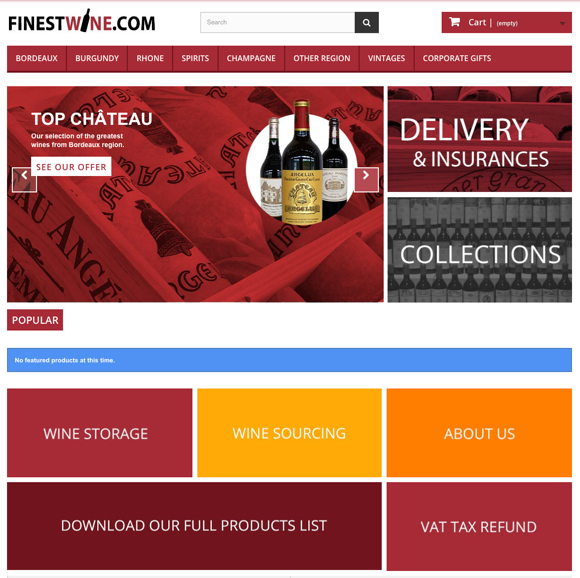
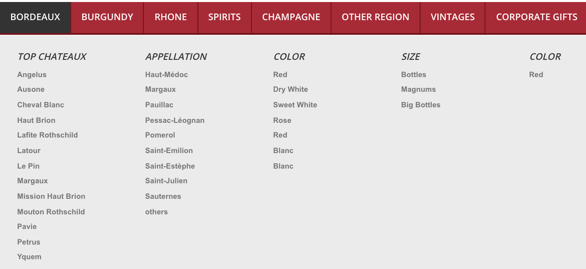

## Design Features
*white red black
Modern, logo

## Search Features 
*Bars at the top – pull down to have sections (top chateauxs, appealations, colour, size
*Other regions – all regions displated, vintage – all vintages 
*for individual region side panal where you can select - 
( price min – max), colour, appelation, region, size, vintage. 
Linear with – year 
*option to compare 
*sort by: price, product name, price low to high or other, reference:lowest or highest first 

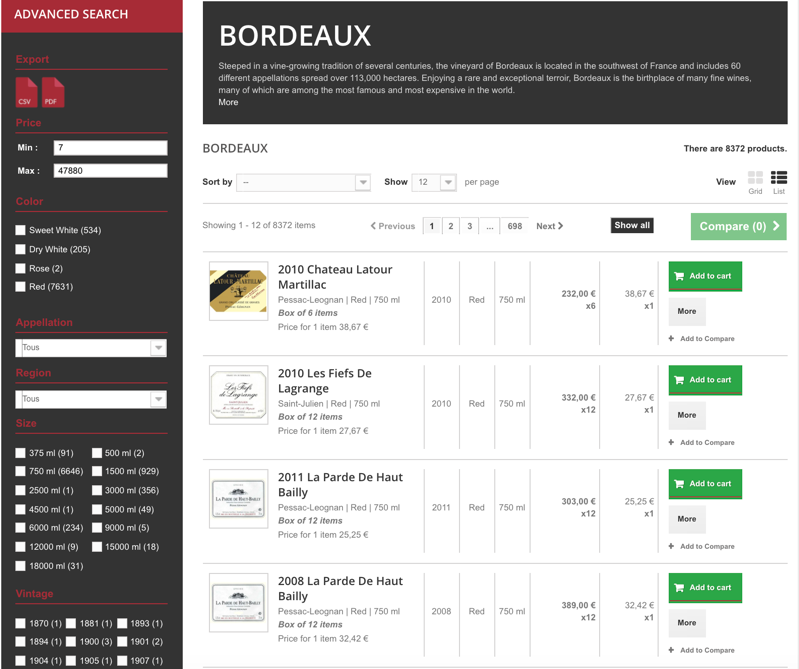

## Other Features 
Shows eg for Bordeaux – 8372 bottles to choose from and burgundy 1934, 
*? DRC collection, Leroy SA collection ?

## Single Bottle Page 
  • Image of lable 
  • Name region, colour, size, rice
  • “data sheet” – type colour region appellation size vintage contry units
  • Other products in same category – with links 

## Shipping / Notes 
  • Doesnt go into detail about producer just a site to sell with large listings
  • Can buy many of even rare bottles not limited
  • Bottle image or lable no date just regular
  • Large inventory – promote selling boxes
