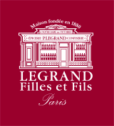

[PAGE PRINCIPALE](https://github.com/wSzki/legrand)

# Referentiel de sites de vente de vin a l'international

##### Classement par ordre décroissant d'importance

##### Index

[22](https://github.com/wSzki/legrand/blob/master/referentielSiteVenteVin.md#22) | 
[21](https://github.com/wSzki/legrand/blob/master/referentielSiteVenteVin.md#21) | 
[20](https://github.com/wSzki/legrand/blob/master/referentielSiteVenteVin.md#20) | 
[19](https://github.com/wSzki/legrand/blob/master/referentielSiteVenteVin.md#19) | 
[18](https://github.com/wSzki/legrand/blob/master/referentielSiteVenteVin.md#18) | 
[17](https://github.com/wSzki/legrand/blob/master/referentielSiteVenteVin.md#17) | 
[16](https://github.com/wSzki/legrand/blob/master/referentielSiteVenteVin.md#16) | 
[15](https://github.com/wSzki/legrand/blob/master/referentielSiteVenteVin.md#15) | 
[14](https://github.com/wSzki/legrand/blob/master/referentielSiteVenteVin.md#14) | 
[13](https://github.com/wSzki/legrand/blob/master/referentielSiteVenteVin.md#13) | 
[12](https://github.com/wSzki/legrand/blob/master/referentielSiteVenteVin.md#12) | 
[11](https://github.com/wSzki/legrand/blob/master/referentielSiteVenteVin.md#11) | 
[10](https://github.com/wSzki/legrand/blob/master/referentielSiteVenteVin.md#10) | 
[09](https://github.com/wSzki/legrand/blob/master/referentielSiteVenteVin.md#09) | 
[08](https://github.com/wSzki/legrand/blob/master/referentielSiteVenteVin.md#08) | 
[07](https://github.com/wSzki/legrand/blob/master/referentielSiteVenteVin.md#07) | 
[06](https://github.com/wSzki/legrand/blob/master/referentielSiteVenteVin.md#06) | 
[05](https://github.com/wSzki/legrand/blob/master/referentielSiteVenteVin.md#05) | 
[04](https://github.com/wSzki/legrand/blob/master/referentielSiteVenteVin.md#04) | 
[03](https://github.com/wSzki/legrand/blob/master/referentielSiteVenteVin.md#03) | 
[02](https://github.com/wSzki/legrand/blob/master/referentielSiteVenteVin.md#02) | 
[01](https://github.com/wSzki/legrand/blob/master/referentielSiteVenteVin.md#01) | 

---

| CODE | COUNTRY |
| --- | --- |
| FRA | FRANCE |
| SIN | SINGAPORE |
| CHI | CHINA |
| DEN | DENMARK |
| SWI | SWITZERLAND |
| BEL | BELGIUM |
| AUS | AUSTRIA |
| U-K | UNITED KINGDOM |
| GER | GERMANY |
| USA | UNITED STATESx |

---

##### [22]
---
   
    [SIN] Cru World Wine

##### [20]
---
   
    [SIN] Wine culture Singapore

##### [19]
---
   
    [AUS] Kracher Fine Wine

##### [17]
---
   
    [CHI] Shanghai Jing Xiang Foodstuff

##### [16]
---
    
    [AUS] Wein & Co

##### [14]
---
    
    [GER] Y18 global wines

##### [13]
---
    
    [AUS] Pub Klemo
    
    [SWI] Arvi

##### [12]
---
    
    [SIN] AA French Wine Pte Ltd

##### [11]
---
    
    [SIN] Crystal Wines

    [SWI] Lucullus
    [SWI] Granchateaux
    
    [BEL] Nv voeding lesage
    
    [FRA] chateauprimeur.com
    [FRA] Vins Grands Cru

##### [10]
---
    
    [SIN] Millesima – Singapore
    
    [AUS] Wein. Depot Noitz
    
    [SWI] Millesima – Suisse Francaise 
    
    [BEL] Belgium wine watchers
    
    [FRA] Finest Wine
    
    [USA] Aabalat fine and rare wine 

##### [09]
---
    
    [GER] Kerry wines
    [GER] Wine explorer
    
    [CHI] Lady Penguin Beijing 
    
    [SWI] GRVins
    
    [FRA] Millesimes, SA
    
    [U-K] Crump Richmond and Shaw fine wines

##### [08]
---
    
    [GER] Millesima – Germany 
    
    [BEL] Esprit des vins
    [BEL] Millesima – belgium
    
    [FRA] Vins & Millesimes 

##### [07]
---
    
    [SIN] Vinum Fine Wines
    
    [AUS] Millesima – Austria
    
    [GER] Wein Total
    [GER] Hong Kong winevault 
    [GER] The fine wine experience 
    [GER] W cellar Limited 
    
    [SWI] Daniel Gazzar Vins
    
    [DEN] rareWine.dk
    [DEN] Vinomani
    [DEN] Finewine.dk
    
    [BEL] Finest wines
    
    [FRA] Vinoptimo
    
    [USA] European wine resources 
    [USA] K&L wine merchant 

##### [06]
---
    
    [SIN] Saint Julien Pte Ltd
    [SIN] Fine Wine SG Pte Ltd
    
    [AUS] IWB – Huber Fohringer
    
    [GER] Lobenbergs GUTE WEINE
    [GER] Bacchus Vinothek
    [GER] Weinemotionen – KK Handels 
    [GER] Axel Buess Exquisite Weine
    [GER] SYBA China Ltd
    [GER] Fortuna wines international
    [GER] Ganpei vintners ltd 
    [GER] Riepenau fine and rare
    [GER] RNG wines ltd 
    
    [SWI] AMP International Trading
    [SWI] Arthurs Cellar
    [SWI] Nicolas Schilling SA
    
    [DEN] Kjaer Sommerfeldt
    [DEN] Philipson Wine
    
    [BEL] Dignef fine wines 
    [BEL] Book a wine
    
    [FRA] Comptoir Des Millesimes
    [FRA] SoDivin
    
    [U-K] Millisima
    [U-K] Four walls wine company
    
    [USA] Wine exchange 
    [USA] Millesima -USA 
    [USA] Benchmark wine group 
    [USA] Fine wines international 
    [USA] Zachys wine and liquor, inc 

##### [05]
---
    
    [SIN] Vinum Fine Wines
    
    [GER] Cave Du Connaisseur
    
    [CHI] Jiu Q
    
    [SWI] Winkler Wines Retail
    
    [DEN] Philipson Wine
    [DEN] Brdr. Schmidt Vinhandel
    
    [BEL] Tresors de la cave
    [BEL] Wine idea SA
    [BEL] OSIRIS sprl.
    
    [SWI] Vinothek im Prk AG
    
    [FRA] IDealwine France 
    [FRA] La Cave Du Marche
    [FRA] Vinatis France 
    
    [U-K] Lay and wheeler wine merchants 
    [U-K] Fine and rare wines
    [U-K] Berry bros and Rudd 
    [U-K] Friarwoods fine wines
    
    [USA] B-21 
    [USA] Wally’s wine & spirits 
    [USA] Southeby’s wine New York retail 
    [USA] Grand vin wine merchant 
    [USA] Wine.com 

##### [04]
---

    [GER] Weinhandel Grubis Weine
    [GER] FineWineSelect
    [GER] Cru world wine
    [GER] Millsima-Hong Kong 
    [GER] Hong Kong wine vault 
    [GER] Wine buff fine wines 
    [GER] Chateau Bordeaux 

    [DEN] Vinexus Wine Selection Denmark
    [DEN] Border wines

    [BEL] Vyncke-Daels
    [BEL] La galerie des vins
    [BEL] Wineclassics
    [BEL] Delef fine wines
    [BEL] Vinrare.be

    [FRA] Cave De Famille
    [FRA] Comptoir Des Vignobles
    [FRA] Millesima – France 
    [FRA] Chai des Chartreux 

    [USA] Irongate.wine 
    [USA] Applejack wine & spirits 
    [USA] JJ Buckley fine wines 
    [USA] America’s wine shop 
    [USA] Laguna cellar 
    [USA] Your wine cellar 
    [USA] Wine cellarage 

##### [03]
---

    [GER] Schreiblehner wein bewegt
    [GER] El-Shagis Weinselektion
    [GER] Movenpick Wein Deutschland
    [GER] Altaya wines
    [GER] Citicellar
    [GER] Jebsen fine wines
    [GER] Major cellar 
    [GER] Victoria wine cellar
    [GER] Paulson Rare Wine
    [GER] Jointek finds wines 

    [CHI] LPT Trade Co Ltd
    [CHI] Auchan Wines

    [SWI] Best Wine Prices 
    [SWI] Denz Weine
    [SWI] Fusters Wy-Bude AG

    [DEN] Greenwood fine wine
    [DEN] Lorentsens Vinforsyning
    [DEN] Theis vine 

    [BEL] Van hende SA
    [BEL] General stores wimes and liqueurs
    [BEL] Magnus kwaliteitswijnen
    [BEL] Green valley
    [BEL] Private sommelier

    [FRA] Premiers Grands Crus
    [FRA] Special Wine
    [FRA] Wines Prestige Select 
    [FRA] CVFwine.com
    [FRA] La Cave du Chateau

    [U-K] MRM wine investments 
    [U-K] Wineeye.com
    [U-K] Cru world wine
    [U-K] BI wines and spirits 
    [U-K] Wilkinson vinterns
    [U-K] Nickolls and Perks
    [U-K] House of townend
    [U-K] Vintagewinegifts.co.uk 

    [USA] Wine house 
    [USA] The wine house, San Francisco 
    [USA] Spectrum wine retail 
    [USA] The Redd collection 
 

##### [02]
---

    [GER] Omtis fine wines 
    [GER] Vintage grand cru
    [GER] Metropolitan wine cellar limited 
    [GER] Chateau cru wine shop 
    [GER] Nanpu fine wine and spirits 
    [GER] Cult wines HK 

    [SWI] Arion Vins & Alcools Sarl
    [SWI] La Cave De Reverolle
    [SWI] House of Grauer

    [DEN] Peter solberg A/S
    [DEN] Bagsvaerd Vinhandel
    [DEN] Lautia Vino Fino
    [DEN] Leisner Wine
    [DEN] H.J. Hansen Vin A/S
    [DEN] Benconi Vinimport
    [DEN] Vinova.dk
    [DEN] Vinens Verden, Slotsgate
    [DEN] Goldenwine.dk
    [DEN] Lars Bjorn Vini
    [DEN] Logismose vin

    [BEL] Vinum S
    [BEL] Vino-Antica 
    [BEL] Dewit wines SA
    [BEL] Dulst

    [FRA] CM Vins The Wine Supplier 
    [FRA] Fell Rouge
    [FRA] Nobles Crus
    [FRA] Maison Dubecq
    [FRA] Ovinia 
    [FRA] Caveau De La Tour

    [U-K] James Nicholson wine merchant 
    [U-K] BBX Berry’s broking exchange
    [U-K] Robert rolls and co
    [U-K] Farr Vintners
    [U-K] Woodwinters wines and whiskies 
    [U-K] Lea and sandeman 
    [U-K] Roberson wine retail
    [U-K] Turville valley wines
    [U-K] Erin vintners 
    [U-K] Colombier vins fins 

    [USA] Mt. Camel wine & spirits co. 
    [USA] International wine shop 
    [USA] Ace wine & spirits 
    [USA] 20-20 wine merchant 
    [USA] Vinfolio 
    [USA] Flickinger wines 
    [USA] Bedford wine merchant 
    [USA] Varmax liquor pantry 
    [USA] Concierge sales - total wine & more 

##### [01]
---

    [SIN] Wines Wholesales 
    [SIN] Wines online

    [AUS] Vinothek La Cave
    [AUS] Gawein Bruckner Weinhandel
    [AUS] Perlage – Champagne & Co 
    [AUS] Classic-Wine.com
    [AUS] Wagners Weinshop
    [AUS] Julies Meinl am Graben
    [AUS] May Wines KG

    [GER] Sutil’s Fine Wine
    [GER] Vinocentral
    [GER] Alfavin
    [GER] ColdDuck Wines
    [GER] IdealWine- Germany 
    [GER] Honk Kong
    [GER] Evercohol wine shop
    [GER] Kings wine cellar
    [GER] DFV fine wines 
    [GER] Berry bros and Rudd Hong Kong 
    [GER] Grand cru international cellar ltd 
    [GER] Classy wines limited
    [GER] Superb wine company
    [GER] GDV fine wines

    [CHI] Auchan Wines
    [CHI] Pudao Wines China
    [CHI] Jui Wo Wang
    [CHI] Southern China international red wine exchange centre
    [CHI] Yesmywine.com
    [CHI] 19online.cn
    [CHI] Oldvin.net
    [CHI] Suning.com
    [CHI] 12580wine.com

    [SWI] Boucherville AG
    [SWI] Bonus Vinus SA
    [SWI] Les Trois Bouchons 
    [SWI] Movenpick Schweiz
    [SWI] FineWines.ch
    [SWI] Maison Magnin Vins
    [SWI] Cave SA
    [SWI] Chiodi Ascona
    [SWI] Le Caveau de Bacchus
    [SWI] Flaschenpost 

    [DEN] Taastrup Ny Vinhandel
    [DEN] Vinslottet
    [DEN] A Vinstouw
    [DEN] Slagelse VinKompagni
    [DEN] Grand cru wine
    [DEN] Benconi Vinimport
    [DEN] Otto suenson & co
    [DEN] Kokkwns vinhus

    [BEL] Nevejan
    [BEL] Piko wines
    [BEL] Dirk grandry winebrokers
    [BEL] Mature wine finder
    [BEL] Axybel
    [BEL] Bottle advice
    [BEL] Lidl.be 
    [BEL] De keyzer drinks
    [BEL] De Musketiers
    [BEL] Cora wine

    [FRA] ChristiWines
    [FRA] La Vinotheque de Bordeaux
    [FRA] Pleasure Wine 
    [FRA] Cavissima
    [FRA] Terroir and Tradition
    [FRA] Fab and Wine- International
    [FRA] Maison Brusina-Brandler
    [FRA] La Cave Trie-Chateau 
    [FRA] Mon Copain Caviste 
    [FRA] Chateau.com
    [FRA] Wine Private Services

    [U-K] Morgan classic wines
    [U-K] Corney and barrow
    [U-K] Daveys wine merchants 
    [U-K] Wine trove
    [U-K] Divine fine wines
    [U-K] Cult wines ltd

