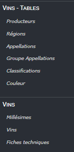
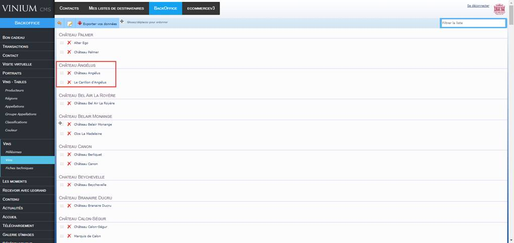

# [CAVES LEGRAND](https://www.caves-legrand.com/en/wines/our-estates)
## Etude de CMS

## CMS A VOIR

#### -> [COMPARATIF TEXTE DE DIFFERENTS CMS](https://github.com/wSzki/legrand/blob/master/comparatif.md)

|    CMS                          |      COMMENTAIRE                                                                          
|    ---                          |       ---                                                                                 
|    PRESTAHOP                    |       ---                                                                                 
|    SHOPIFY                      |       > Plugins non editables - Ne repondent pas specifiquement aux besoins de LFF                                  
|    MAGENTO **[A VERIFIER]**     |       > Bilbiotheque de plugin peu fournie                                                
|    WOOCOMMERCE **[A VERIFIER]** |       > Framework basé sur Wordpress, a priori peu de support                             
|    ~~OPENCART~~                 |       > Ne repond pas aux besoins                                                         
|    ~~TYPO3~~                    |       > Ne repond pas aux besoins                                                         
|    ~~DRUPAL~~                   |       > CMF (Content Management Framework) a proscrire car implique trop de developpement    
|    ~~LARAVEL~~                  |       > CMF (Content Management Framework) a proscrire car implique trop de developpement 
|    ~~BIGCOMMERCE~~              |       > Ne repond pas aux besoins                                                         
|    ~~CRAFTCMS~~                 |       > Ne repond pas aux besoins                                                           
|    ~~SANITY~~                   |       > Ne repond pas aux besoins                                                          
|    ~~3DCART~~                   |       > Ne repond pas aux besoins                                                         

## SHOPIFY & PRESTASHOP

  - [ETUDE DU CMS SHOPIFY](https://github.com/wSzki/legrand/blob/master/etudeShopify.md)  
  - [ETUDE DU CMS PRESTASHOP](https://github.com/wSzki/legrand/blob/master/etudePrestashop2noimg.md)

---

## [CONTRAINTES TECHNIQUES]

### _[Vente de produit HT et TTC dans un meme panier]_
---

- Difference de prix HT et TTC
  * Prix HT pour professionels
  * Prix HT sur les primeurs
    > Les primeurs sont facturés HT, puis TTC + frais de port et de conditionnement lors de l'expedition
    > Les vins non primeur integrent le prix du conditionnement.

---
### _[Multitude de references, d'options de conditionnement et d'envoi]_
---

- Differentes references :
  * **134** references de vins primeur au 01/03/2020 [Bordeaux uniquement]
  * **350** references de selection de vins au 01/03/2020 [Bordeaux uniquement]
  * **3700** vins référencés au total
  * Une partie du catalogue est **"sous allocation"**, soit non references sur le site / catalogue, reserves pour un type de clientele.
---
- Differentes options de conditionnement :
  * Bouteilles = Mangnums, Bouteilles de 75cL
  * Caisses = Differents types 

---
- Differentes options d'envoi
  * Services de livraison 
    * Livraison UPS/COLISSIMO, Transporteur privé, retrait en magasin.
      > Voir **[UPELA](https://www.upela.com/en/)**

  * Variables dans le calcul du prix total :
    * Prix de la livraison en fonction de la distance et du poids
    * Prix du caissage et des bouteilles utilisées 
---
- Options de paiement:
  * CB
  * Mastercard
  * Visa
  > AMEX [NON] car 2.5% comission  
  > Paypal [NON] car 5% comission

---
### _[Catalogue de vins **sous allocation** accessible a un type de clientèle précis, mais visible à tous]_
---

- Bot de suggestion, de type [MATCHA](https://www.matcha.wine/#home)
  * Permet de se passer d'un catalogue classique

- Utilisation d'un catalogue privé
  * Le catalogue doit etre consultable par l'ensemble de la clientele
  * Separation du catalogue de vins sous allocation du reste du catalogue, pour eviter l'abondance de produits hors stocks.

---
### _[Vente de produit livrable et non livrable]_
---

- Degustation 
  * Evenement - vente d'une place pour degustation.
    * Prix - 80 euros en moyenne variable de 65 a 190 euros
    * Reservation pour 1 a 5 personnes
---
- Primeur 
  * Vente d'une cuvée dans différents formats et caissages + prix de vente HT avec des supplements en fonction des formats de caissage
---
- Bons cadeau pour degustation - diner

---
---
## [EXEMPLES]

#### [Primeur]
---

#### [Prix des conditionnements]
---

#### [Structure type d'un article]
---

---
