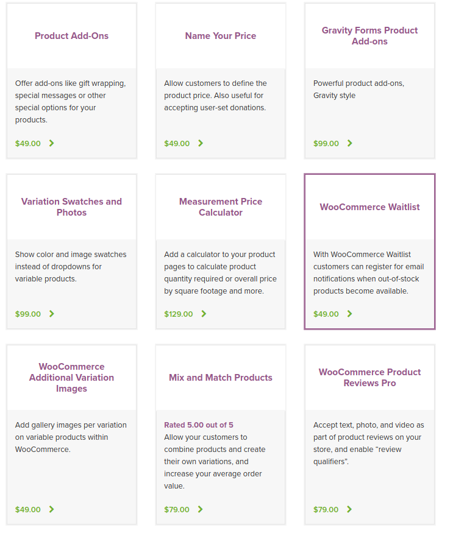
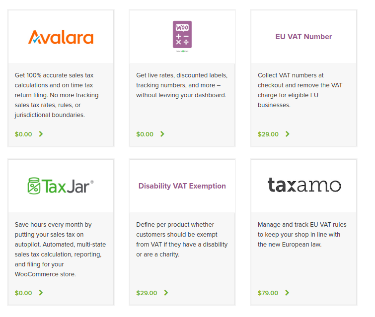

[PAGE PRINCIPALE](https://github.com/wSzki/legrand)

# WOOCOMMERCE

Based on Wordpress
Open Source, _**Highly Customizable**_

## PLUGINS

### Payment
---

https://woocommerce.com/products/stripe/

    The Stripe plugin for WooCommerce allows you to accept payments directly on your store for web and mobile. With Stripe, customers stay on your store during checkout instead of being redirected to an externally hosted checkout page, which has been proven to lead to higher conversion rates.

### Checkout Fields
---

https://woocommerce.com/products/woocommerce-checkout-field-editor/

Customize your Checkout Fields via your admin panel
The checkout field editor provides you with an interface to add, edit, and remove fields shown on your WooCommerce checkout page. Fields can be added and removed from the billing and shipping sections, as well as inserted after these sections next to the standard ‘order notes’.

The editor supports several types for custom fields including text, select, checkboxes, and datepickers.

### Checkout Add-ons
---

https://woocommerce.com/products/woocommerce-checkout-add-ons/

Easily Offer Free or Paid Add-ons and Services at Checkout
The core WooCommerce checkout process covers all of the basic fields shops needs to place an order, but what if your shop needs to offer services or additional products only at checkout? That’s where WooCommerce Checkout Add-ons comes into play. This extension allows you to add several additional options to your checkout page and determine which are free or paid. You can also sort and filter orders based on your shiny new options.

### Conditional Shipping & Payments
---

https://woocommerce.com/products/conditional-shipping-and-payments/

Use conditional logic to exclude payment gateways and shipping methods
Conditional Shipping and Payments allows you to conditionally restrict the payment gateways, shipping methods and shipping countries/states available on your site.

Define sophisticated rules in minutes and manage them all in one place. Use conditional logic to:

Disable shipping methods based on weight, item count, cart total.
Control the availability of free shipping, flat rates and other shipping options per product, category or shipping class.
Limit shipping method and payment gateway access to specific customers and customer roles, such as membership holders or wholesale customers.
Enable specific payment gateways when purchasing subscriptions.
Create country, state, or zip code shipping restrictions for specific products.

Create rules to conditionally show or hide shipping methods:

Per product, category or shipping class.
By weight, item quantity, or cart total.
When a coupon is activated.
When purchasing subscriptions.
For individual customers, customer roles or site members.

### Tax Exemption
---

https://woocommerce.com/products/woocommerce-tax-exempt-plugin/

WooCommerce Tax Exempt provides you a proper system through which you can give tax exemption to selected customers and user roles.

### Screenshots

