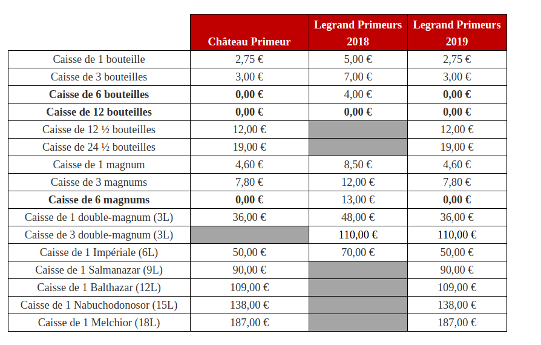
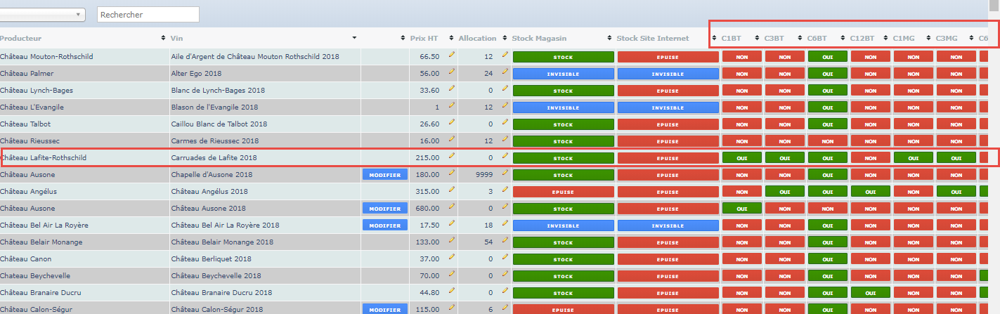
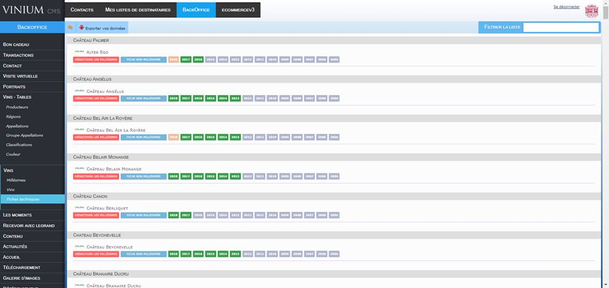

# [CAVES LEGRAND](https://www.caves-legrand.com/en/wines/our-estates)
## Etude de CMS

---

-> [Liste referentielle internationale de sites de vente de vin](https://github.com/wSzki/legrand/blob/master/referentielSiteVenteVin.md)  
-> [Comparaison detailee de sites de vente de vin](https://github.com/wSzki/legrand/blob/master/detailDeSites.md)

---
## [NOTES](./notes.md)

[UPELA]

[1jour1vin]

[Vinatis]

[Matcha]

[Vivino]

[WineAdvisor]

[MonoprixVins]

[IBMwebsphere] > [Millesima]

Existence de differents entrepots

Gestion du stock complexe sans HOOKS (connexion API)

Picking = 7 EUROS

B2B = Business to Business

---

https://ecommerce-platforms.com/articles/shopify-pricing-starter-vs-basic-vs-professional-vs-unlimited-which-plan-is-best-for-you

## CMS A VOIR

#### -> [COMPARATIF TEXTE DE DIFFERENTS CMS](https://github.com/wSzki/legrand/blob/master/comparatif.md)

[O] [Prestashop](https://github.com/wSzki/legrand/blob/master/prestashop.md)

[O] [Magento](https://github.com/wSzki/legrand/blob/master/magento.md)

[O] [Shopify](https://github.com/wSzki/legrand/blob/master/shopify.md) 

[X] [Woocommerce](https://github.com/wSzki/legrand/blob/master/woocommerce.md) BASED ON [WORDPRESS]

> Available plugins are too basic for the needs.

[X] [Opencart](https://github.com/wSzki/legrand/blob/master/opencart.md)

> Trop Basique

[X] [Typo3](https://github.com/wSzki/legrand/blob/master/typo3.md)

[X] [Drupal](https://github.com/wSzki/legrand/blob/master/drupal.md) [CMF]

[X] [Laravel](https://github.com/wSzki/legrand/blob/master/laravel.md) [CMF]

> CMF (Content Management Framework) a proscrire car implique trop de developpement

[?] [BigCommerce]

[?] [CraftCMS]

[?] [Sanity]

## [CONTRAINTES TECHNIQUES]

### Vente de produit HT et TTC dans un meme panier
- Difference de prix HT et TTC
  * Prix HT pour professionels
  * Prix HT sur les primeurs
    > Les primeurs sont facturés HT, puis TTC + frais de port et de conditionnement lors de l'expedition
    > Les vins non primeur integrent le prix du conditionnement.

### Multitude de references, d'options de conditionnement et d'envoi

- Differentes references :
  * **134** references de vins primeur au 01/03/2020 [Bordeaux uniquement]
  * **350** references de selection de vins au 01/03/2020 [Bordeaux uniquement]
  * **3700** vins référencés au total
  * Une partie du catalogue est **"sous allocation"**, soit non references sur le site / catalogue, reserves pour un type de clientele.
---
- Differentes options de conditionnement :
  * Bouteilles = Mangnums, Bouteilles de 75cL
  * Caisses = Differents types 

---
- Differentes options d'envoi
  * Services de livraison 
    * Livraison UPS/COLISSIMO, Transporteur privé, retrait en magasin.
      > Voir **[UPELA](https://www.upela.com/en/)**

  * Variables dans le calcul du prix total :
    * Prix de la livraison en fonction de la distance et du poids
    * Prix du caissage et des bouteilles utilisées 
---
- Options de paiement:
  * CB
  * Mastercard
  * Visa
  > AMEX [NON] car 2.5% comission
  > Paypal [NON] car 5% comission

### Vente de produit livrable et non livrable
---
- Degustation 
  * Evenement - vente d'une place pour degustation.
    * Prix - 80 euros en moyenne variable de 65 a 190 euros
    * Reservation pour 1 a 5 personnes
---
- Primeur 
  * Vente d'une cuvée dans différents formats et caissages + prix de vente HT avec des supplements en fonction des formats de caissage
---
- Bons cadeau pour degustation - diner

---

## [A INTEGRER]

    - RENDU 3D 

    - Creation de comptes "premium" pour le catalogue des vins sous allocation

    - Ventes Flash, ventes privées
    
    - Commentaires, evaluation Utilisateur

    - Services Legrand [?]
      * Cadeau d'entreprise
      * CHR
      * Evenementiel
      * Conservation
      * Epicerie 
      * Accessoires et livres? 
      * Gestion de Caves
      * Livraison

    - Navision [?]
    - CRM (Tracking client) [?]

---

## [EXEMPLES]

#### Primeur

#### Structure type d'un article

# _**ARCHIVE**_
---

## BUGS [LIENS MORTS]

[Lien vers la page](https://www.caves-legrand.com/en/wines/our-estates)

    Benjamin Leroux
    Cedric Bouchard
    Château Auney L'Hermitage
    Chartigne Taillet
    Château Certan de May
    Chateau Canon
    Chateau Chasse Spleen
    Château Clerc-Milon
    Château Dassault
    Château d'Yquem
    Château d'Aussières
    Château d'Armailhac
    Château des Tours

---
## [NOTES] 02.03.2020
    | Voir Bugs
    | Totalité de la selection primeur en rupture de stock
    | Impossibilité d'ajouter un vin de la selection au panier

    | Comment changer l'affichage du prix TTC > HT?

    | Quelle est la difference entre un CMSystem (PrestaShop) et un CMframework (Laravel, Drupal)
    | Question : Un CMF est il envisageable? 
    | Ventes internationales ?
    | Retours Produits ?

    | Paiement partiel pour primeur? T

    | Service Legrand a integrer (epicerie, accessoires, livres, evenement d'entreprise)?
---
